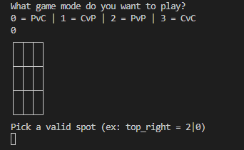
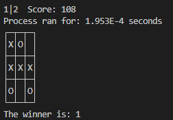

# TicTacToe
  
A place for my dabbling in tic-tac-toe and minimax algorithms.

## ✨ Features
+ View mid-game computer scores/evaluations of the board state
+ See run time of a move
+ Play computers against each other

## 💻 Tech Stack


## 📝 How to use
+ Follow the text prompts as provided.
+ Play Tic-Tac-Toe against a minimax algorithm in any of the following ways:
  + Player vs. Comp
  + Comp vs. Player
  + Player vs. Player
  + Comp vs. Comp
+ Enter your moves in coordinate form: X,Y or X|Y

## Prerequisites
None

## Installation
Clone the repo: ```bash git clone https://github.com/Nick-Maehr/TicTacToe ```  
Enjoy

## 🧠 Lessons Learned
- Practice with recursion
- How a minimax algorithm works
- Designing a logic-based prediction system
- Understanding what makes a move worth exploring (alpha-beta pruning)
- Introduction to optimizing run time

## 📸 Sample Images
<p align="center">
   
  
</p>
